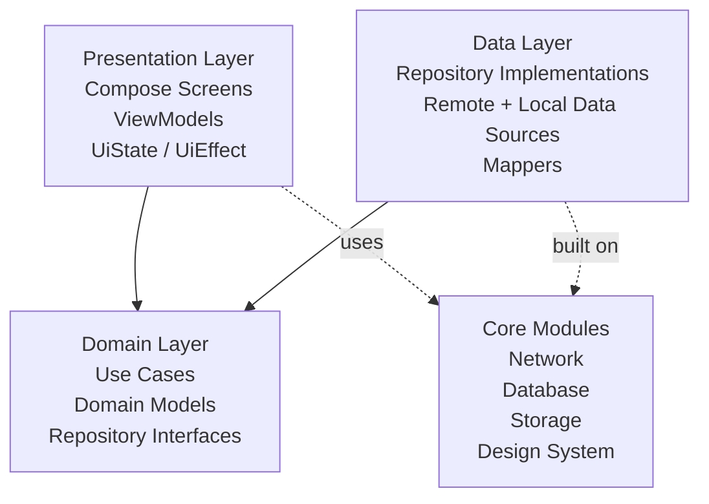
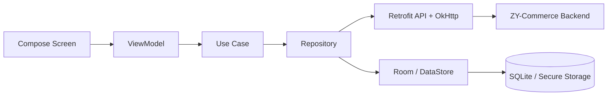
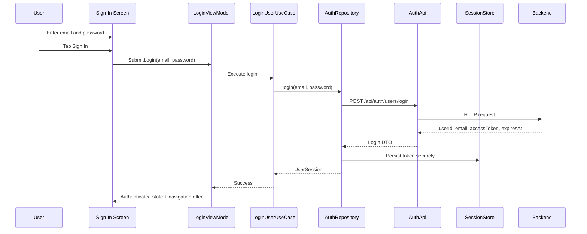

# High‑Level Technical Design — ZY‑Commerce Android App (MVP)

If any assumption here conflicts with `requirements/mvp_requirements_ecommerce.md` or `requirements/ecommerce-android-plan.md`, prefer those files and treat this document as needing revision.

## Tech Stack & Rationale
- Language: Kotlin
  - Why: First-class Android support, coroutine-native, best ecosystem fit for new Android work.
- UI: Jetpack Compose + Material 3
  - Why: Fastest path for modern Android UI, strong state integration, good support for forms, lists, dialogs, and adaptive layouts.
- Architecture: Clean Architecture + MVVM with unidirectional state flow
  - Why: Clear boundaries for AI-assisted implementation, easier testing, lower ceremony than full MVI for this MVP.
- Dependency Injection: Hilt
  - Why: Standard Android DI, integrates well with ViewModel, Room, Retrofit, and WorkManager.
- Async/Reactive: Kotlin Coroutines + Flow/StateFlow/SharedFlow
  - Why: Supports session state, screen state, search, pagination, and async network/database work cleanly.
- Network: Retrofit + OkHttp + Kotlinx Serialization
  - Why: Typed APIs, interceptor support, Kotlin-native serialization, predictable error handling.
- Local Data: Room
  - Why: Best fit for product catalog caching and future offline-read support.
- Key-Value Storage: DataStore + encrypted storage strategy
  - Why: Good for token/session persistence and debug configuration without abusing Room.
- Pagination: Paging 3
  - Why: Directly supports `ST-09` and keeps product list scalable.
- Image Loading: Coil
  - Why: Product images are out of scope now, but Coil is the Compose-native choice when they arrive.
- Background Work: WorkManager
  - Why: Not central to MVP, but it is the correct seam for future sync/retry work.
- Testing: JUnit, MockK, Truth, Turbine, kotlinx-coroutines-test, MockWebServer, Compose UI Test, Hilt testing
  - Why: Covers unit, integration, UI, and regression levels with low friction.

## Architecture & Layering
- Presentation: Compose screens, reusable UI components, navigation, ViewModels, UI state/effects
- Domain: Use cases, domain models, repository interfaces
- Data: Repository implementations, Retrofit APIs, Room DAOs/entities, DataStore/session storage, mappers
- Cross-cutting: DI modules, logging, error mapping, environment/base URL configuration, network security config

Allowed dependencies: Presentation -> Domain. Data -> Domain. App and feature modules may depend on shared core modules. Domain must not depend on Android, Retrofit, Room, or Hilt.

### Why this layering fits the backlog
- Sprint 1 needs stable auth/session, public catalog read flows, and protected-action gating.
- Sprint 2 adds search/filter/paging and product write flows.
- Separating Domain and Data keeps those later features from leaking backend concerns into Compose screens.

### Component Breakdown
- App shell: `MainActivity`, app navigation host, `@HiltAndroidApp` application
- Feature modules:
  - `feature-auth`: register, sign-in, profile
  - `feature-catalog`: product list, search, filter, pagination, detail
  - `feature-productadmin`: create, update, deactivate product
- Domain modules:
  - `domain-auth`
  - `domain-catalog`
- Data modules:
  - `data-auth`
  - `data-catalog`
- Core modules:
  - `core-common`
  - `core-designsystem`
  - `core-network`
  - `core-database`
  - `core-storage`

## Project / Module Structure
```text
android-app/
  app/
  core/
    common/
    designsystem/
    network/
    database/
    storage/
  domain/
    auth/
    catalog/
  data/
    auth/
    catalog/
  feature/
    auth/
    catalog/
    productadmin/
```

Recommended internal package style:

```text
feature/catalog/
  presentation/
    CatalogRoute.kt
    CatalogViewModel.kt
    CatalogUiState.kt
    CatalogUiAction.kt
    CatalogUiEffect.kt
    components/
  navigation/
```

## Data Model & Persistence

### Domain Models
- `UserSession`
  - `userId`, `email`, `accessToken`, `tokenType`, `expiresAt`
- `CurrentUser`
  - `userId`, `email`
- `ProductSummary`
  - `productId`, `sku`, `name`, `description`, `isActive`, `createdAt`
- `ProductDetail`
  - `productId`, `sku`, `name`, `description`, `isActive`, `createdAt`, `updatedAt`
- `PagedProducts`
  - `items`, `pageNumber`, `pageSize`, `totalCount`, `totalPages`, `hasPreviousPage`, `hasNextPage`

### Room Persistence
Use Room as a read cache, not as the source of truth for business writes.

Entity: `ProductEntity`
- `id`
- `sku`
- `name`
- `description`
- `isActive`
- `createdAt`
- `updatedAt`
- `lastSyncedAt`

Suggested indexes:
- `sku`
- `name`
- `isActive`
- `createdAt`

Room usage for MVP:
- cache product list results
- cache product detail snapshots
- show cached data while refresh is in progress

Not stored in Room for MVP:
- passwords
- refresh tokens
- cart/order data

### DataStore / Secure Storage
Persist:
- access token
- token type
- expiration timestamp
- current user id/email if useful for bootstrapping
- debug environment selection

Do not persist:
- raw password

### Cache Strategy
- Reads: network-first with cache fallback
- Writes: network-first only

Why:
- keeps behavior predictable for `ST-06` through `ST-15`
- avoids premature offline-write complexity

## API Design Conventions

This section defines how the Android app will consume the backend contract already implemented.

### Retrofit API Surface
- `AuthApi`
  - `register(request)`
  - `login(request)`
  - `getCurrentUser()`
- `CatalogApi`
  - `getProducts(searchTerm, isActive, pageNumber, pageSize)`
  - `getProductById(productId)`
  - `createProduct(request)`
  - `updateProduct(productId, request)`
  - `deactivateProduct(productId)`

### DTO Conventions
- DTOs mirror backend JSON exactly
- DTO-to-domain mapping happens in the data layer
- UI must not depend directly on DTOs

### Error Handling Contract
Backend errors are not fully uniform, so normalize all failures into a shared app error model.

Recommended model:

```kotlin
sealed interface AppError {
    data class Validation(val fields: Map<String, List<String>>) : AppError
    data class Conflict(val message: String?) : AppError
    data object Unauthorized : AppError
    data object Forbidden : AppError
    data object NotFound : AppError
    data object NetworkUnavailable : AppError
    data class Unknown(val message: String?) : AppError
}
```

### Auth Header Convention
- Inject `Authorization: Bearer <token>` through an OkHttp interceptor for authenticated requests only.
- Public catalog reads should not require auth header injection.

### Base URL / Local Development
- Emulator: `http://10.0.2.2:5015/`
- Physical device: `http://<mac-local-ip>:5015/`

Recommended environment strategy:
- `localEmulator`
- `localWifi`
- `staging`
- `prod`

Enable cleartext HTTP only in debug/local builds using Android network security config.

## UI Architecture

### Navigation
- Splash / Session Restore
- Sign In
- Register
- Catalog List
- Product Detail
- Create Product
- Edit Product
- Profile

### Story-to-Screen Mapping
- `ST-01`, `ST-02` -> Register screen
- `ST-03`, `ST-04` -> Sign-in screen
- `ST-05` -> Profile screen
- `ST-06`, `ST-07`, `ST-08`, `ST-09` -> Catalog screen
- `ST-10` -> Product detail screen
- `ST-11`, `ST-12`, `ST-13` -> Create product screen
- `ST-14` -> Edit product screen
- `ST-15` -> Product detail action flow
- `ST-16` -> Navigation/auth gate behavior

### ViewModel + State Pattern
Each screen should use:
- one immutable `UiState`
- one `UiAction` contract
- optional `UiEffect` for one-off actions

Example:

```kotlin
data class CatalogUiState(
    val isLoading: Boolean = false,
    val items: List<ProductCardModel> = emptyList(),
    val searchTerm: String = "",
    val activeFilter: ActiveFilter = ActiveFilter.All,
    val isPaging: Boolean = false,
    val error: UiMessage? = null
)
```

This keeps screen logic testable and reduces drift in AI-generated code.

### UX Conventions
- Skeleton/loading states for catalog and detail
- Empty state for no products
- Inline form validation for auth and product forms
- Confirmation dialog before deactivation
- Protected-action redirect/prompt for unsigned users
- Snackbars or banners for backend errors
- Accessible labels and 44dp+ touch targets

## Cross-Cutting Concerns & Best Practices
- Validation:
  - validate simple fields locally for fast feedback
  - let backend remain the source of truth for business validation
- Mapping:
  - DTO -> domain in data layer
  - Room entity -> domain in data layer
  - domain -> UI model in presentation only if needed
- Logging:
  - structured debug logging
  - never log tokens or raw secrets
- Security:
  - encrypted token storage
  - debug-only cleartext HTTP
  - no password persistence
- Session lifecycle:
  - on app launch, restore token and validate with `/me` when needed
  - on `401`, clear session and route to sign-in
- Performance:
  - Paging 3 for list growth
  - Room cache for catalog reads
  - avoid premature offline-write syncing
- Accessibility:
  - semantic labels
  - readable error text
  - keyboard/focus-safe forms

## Testing Strategy

Testing is a first-class architecture concern. Keep tests close to the layer that owns the behavior, and use `.harness/docs/TESTING_STRATEGY.MD` for the current unit, integration, UI, regression, and manual QA expectations. Use `.harness/docs/VERIFICATION.MD` for commands and evidence.

## Deliberate MVP Simplifications
- No refresh-token orchestration
- No role/permission branching beyond authenticated vs unauthenticated
- No cart, checkout, payment, or order modules
- No offline write queue or conflict-resolution engine
- No heavy MVI/store framework

These are deliberate choices to keep delivery aligned with the current requirements and sprint plan.

## Risks / Assumptions
- The Android app currently assumes any authenticated user can manage products because the backend has no roles.
- Product-management screens may later need to become admin-only.
- Backend error payloads are not fully uniform.
- Token expiration UX may be abrupt until refresh tokens exist.
- Product images, pricing, stock, and full commerce flows are absent now and must not leak into MVP architecture prematurely.

## Delivery Order Aligned to Sprint Plan
- Sprint 1
  - app shell and navigation
  - DI, network, storage foundation
  - register/sign-in/profile
  - public catalog list/detail
  - protected-action gating
- Sprint 2
  - search/filter/pagination
  - create product
  - duplicate SKU + validation handling
  - update product
  - deactivate product
  - regression/smoke test hardening

## Diagrams (Mermaid)

### Layered Architecture


### Components


### ST‑03 Sign-In Flow


## Final Recommendation
- Use Clean Architecture with MVVM and unidirectional state flow.
- Keep the MVP modular by feature and layer, but do not over-fragment beyond the proposed module set.
- Use Retrofit/OkHttp for network, Room for catalog caching, and DataStore plus encrypted storage for session state.
- Treat testing as a first-class architecture concern. Keep coverage expectations in `.harness/docs/TESTING_STRATEGY.MD` and verification commands in `.harness/docs/VERIFICATION.MD`.
- Keep the architecture scoped to the implemented backend slice. Do not let future cart/checkout/order concerns distort the current MVP design.
